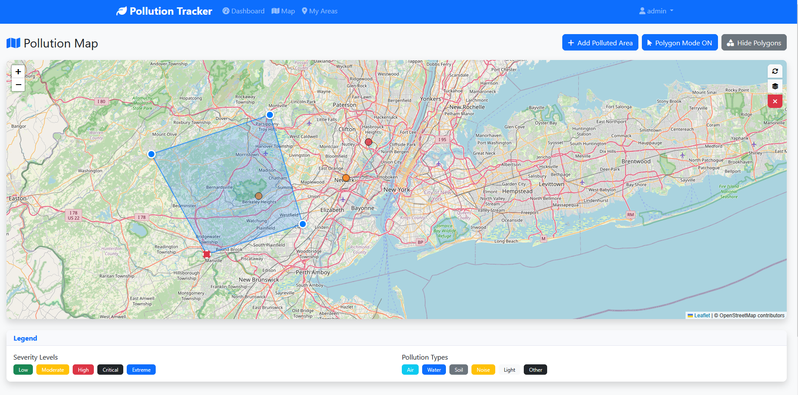

# Pollution Tracker

A Django-based web application for tracking and mapping polluted areas with interactive polygon drawing capabilities.

## Features

- **User Authentication**: Secure login and registration system
- **Interactive Map**: Leaflet.js-powered map with zoom and pan controls
- **Polygon Drawing**: Click-to-draw polygon functionality for marking polluted areas
- **Pollution Management**: Add, view, and manage pollution reports
- **Dashboard**: Overview of pollution statistics and recent activities
- **Responsive Design**: Mobile-friendly Bootstrap interface

## Screenshots

The application includes:
- Interactive map with polygon drawing tools
- Pollution area markers with severity-based coloring
- Toggle visibility for polygon overlays
- Modal forms for adding new pollution areas
- User dashboard with statistics

## Installation

### Prerequisites

- Python 3.8+
- pip
- Git

### Setup

1. **Clone the repository**
   ```bash
   git clone https://github.com/yourusername/pollution-tracker.git
   cd pollution-tracker
   ```

2. **Create a virtual environment**
   ```bash
   python -m venv venv
   # On Windows:
   venv\Scripts\activate
   # On macOS/Linux:
   source venv/bin/activate
   ```

3. **Install dependencies**
   ```bash
   pip install -r requirements.txt
   ```

4. **Set up the database**
   ```bash
   python manage.py makemigrations
   python manage.py migrate
   ```

5. **Create a superuser**
   ```bash
   python manage.py createsuperuser
   ```

6. **Run the development server**
   ```bash
   python manage.py runserver
   ```

7. **Access the application**
   - Open your browser and go to `http://127.0.0.1:8000/`
   - Register a new account or use the superuser account

## Usage

### Adding Polluted Areas

1. Navigate to the Maps page (`/maps/`)
2. Click the "Click to Add" button to enable polygon drawing mode
3. Click multiple points on the map to define the polluted area
4. Click the first point again to complete the polygon
5. Fill out the pollution details in the modal form
6. Submit to save the area

### Managing Areas

- Use the "Show Polygons" / "Hide Polygons" button to toggle polygon visibility
- View detailed information by clicking on markers or polygons
- Access the dashboard for statistics and management

## Project Structure

```
pollution-tracker/
├── core/                   # User authentication app
├── maps/                   # Map and pollution area management
├── dashboard/              # Dashboard and statistics
├── templates/              # HTML templates
├── static/                 # Static files (CSS, JS, images)
├── media/                  # User uploaded files
├── pollution_tracker/      # Django project settings
├── requirements.txt        # Python dependencies
└── README.md              # This file
```

## Technologies Used

- **Backend**: Django 4.2.7
- **Frontend**: Bootstrap 5, Leaflet.js
- **Database**: SQLite (development), PostgreSQL (production ready)
- **Forms**: Django Crispy Forms
- **Authentication**: Django built-in auth system

## API Endpoints

- `/` - Home page
- `/login/` - User login
- `/register/` - User registration
- `/dashboard/` - User dashboard
- `/maps/` - Interactive map
- `/maps/areas/json/` - JSON API for pollution areas

## Contributing

1. Fork the repository
2. Create a feature branch (`git checkout -b feature/amazing-feature`)
3. Commit your changes (`git commit -m 'Add some amazing feature'`)
4. Push to the branch (`git push origin feature/amazing-feature`)
5. Open a Pull Request

## License

This project is licensed under the MIT License - see the [LICENSE](LICENSE) file for details.

## Acknowledgments

- Leaflet.js for the interactive mapping functionality
- Bootstrap for the responsive UI framework
- Django for the robust web framework
- Font Awesome for the icons

## Support

If you encounter any issues or have questions, please open an issue on GitHub or contact the development team.